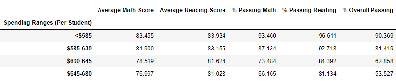

# Pandas School Analysis

## Introduction
This repository contains a jupyter notebook that merges, analyses and displays results from two csv files located in the `Resources` folder\
[students_complete.csv](PyCitySchools/Resources/students_complete.csv): a summary of students with their math and reading scores.\
[schools_complete.csv](PyCitySchools/Resources/schools_complete.csv): a summary of schools in a district with their budget and whether the school is private or public.

## Results

### Whole District Summary:

### By-school analysis:

### Highest-Performing Schools (by % Overall Passing):

### Lowest-Performing Schools (by % Overall Passing):

### Math Scores by Grade

### Reading Scores by Grade

### Scores by School Spending

### Scores by School Size

### Scores by School Type

## Conclusion
Out of the three comparisons in this analysis we can conclude that:
* Average spending (per student) seems to have a **negative correlation** with test results. There's no correlation between spending per student and the fact that an institution is private or public. 
* There is no significant difference between small (<1000 students) and medium (1000-1999 students) size schools. They both **outperformed** big (>2000 students) schools in all tests.
* Charter schools **outperformed** district schools in all tests. However, all district schools fall in the category of big size schools. It is hard to say with the given information whether the results are related to school size or school type.

## Notes

### `Display` function:
Toggles the procedural outputs showing up for every cell. If turned off only **Results** will show
#### How to use:
At the beginning of the code there is a Y/N input, 
* For **Results**, type N or n and hit the `Enter` key.
* For **Results** and procedural output, type Y or y and hit the `Enter` key.
* IMPORTANT: The code ***WILL NOT*** run if this input is ignored or the `Enter` key is not hit.